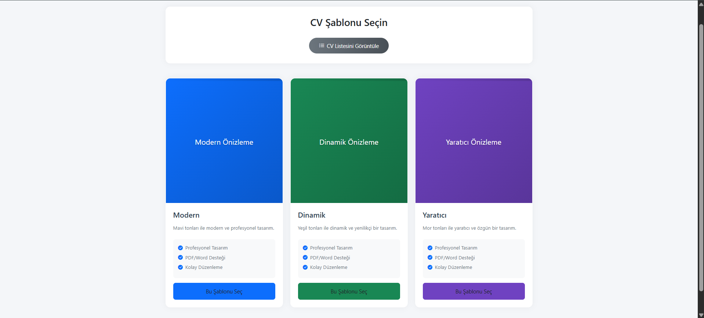
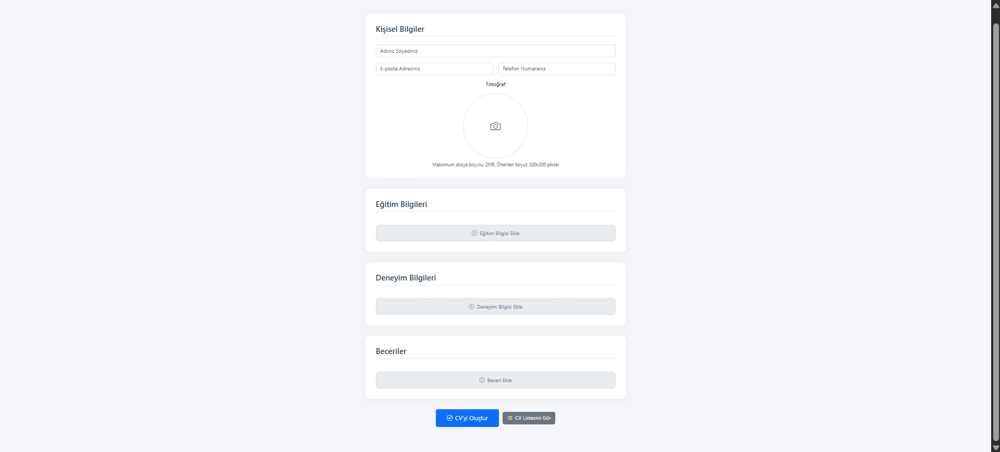
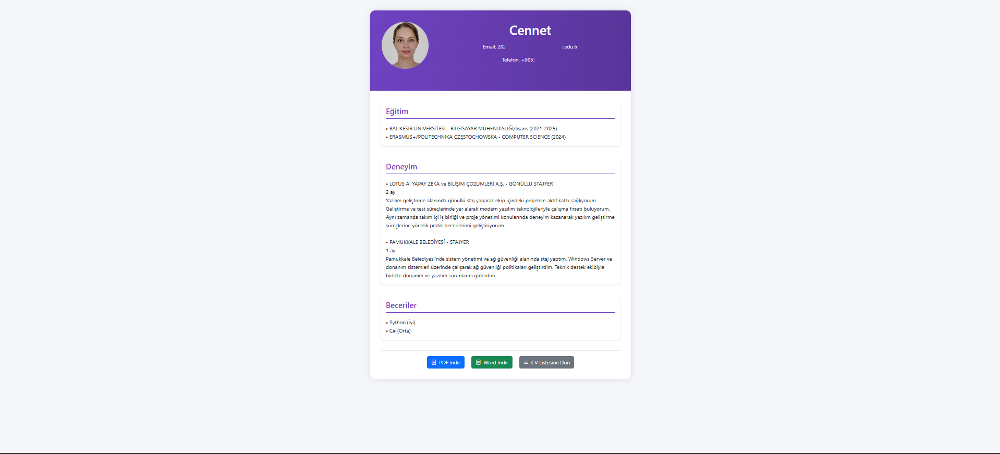
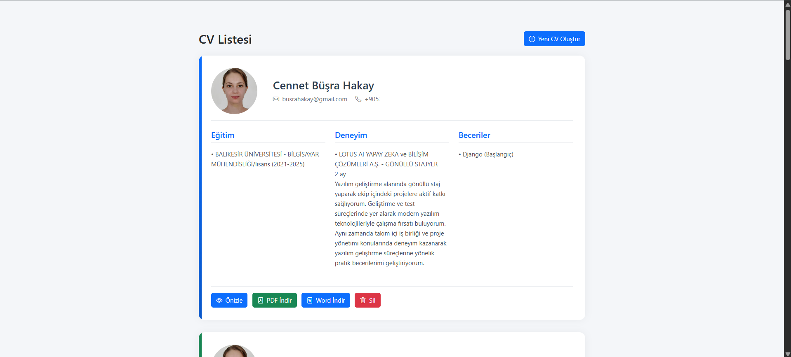

🎓 CV Oluşturma Web Uygulaması  
Kendi özgeçmişinizi oluşturmak hiç bu kadar kolay olmamıştı.  
Bilgilerinizi girin, şablon seçin, tek tıkla PDF veya Word çıktısını indirin.

---

✨ Özellikler

🧾 Kişisel Bilgi, Eğitim, Deneyim ve Beceri Girişi  
🎨 Farklı CV Şablonları Arasından Seçim  
📄 PDF ve Word Formatında Otomatik Çıktı  
📷 Kullanıcı Fotoğrafı Yükleme Desteği  
📁 Medya Dosyalarının Güvenli Saklanması  
🔒 Django Model İlişkileriyle Güvenli Veri Yönetimi  
⚙️ Kullanıcı Dostu ve Temiz Arayüz

---

📦 Kullanılan Teknolojiler

🧠 **Django** – Python tabanlı web framework  
🗃️ **PostgreSQL** – Güvenilir ve ölçeklenebilir veritabanı  
🎨 **HTML + CSS** – Sade ve işlevsel arayüz  
🧾 **xhtml2pdf** – PDF ve Word çıktıları oluşturma  
🔄 (Planlı) **React** ile dinamik frontend geçişi

---

🚀 Kurulum (Local Geliştirme İçin)

Projeyi kendi bilgisayarınızda çalıştırmak için:

```bash
git clone https://github.com/busrahakay/cv_creator/.git
cd cvproje
python -m venv env
source env/bin/activate  # Windows için: env\Scripts\activate
pip install -r requirements.txt
python manage.py makemigrations
python manage.py migrate
python manage.py runserver

---

```markdown
### Başlangıç Ekranı


### Şablon Seçim Ekranı


### Bİlgi Giriş Ekranı


### CV Önizleme Ekranı


### CV Lİstesi Ekranı


### PDF Çıktısı

